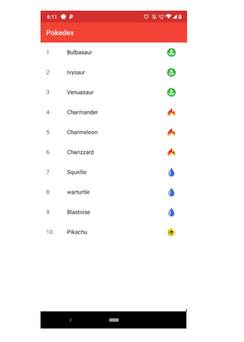
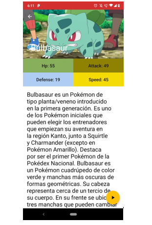
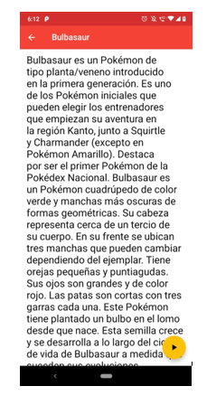

# Pokedex

Pokedex es una aplicación desarrollada en Android Studio con Kotlin que te permite a través de un **RecyclerView** ver una lista de Pokemon, mostrando sus datos como id, nombre y un ícono dependiendo de su tipo de elemento.

Al seleccionar algún Pokemon de la lista, este te llevará a una segunda pantalla, donde podrás visualizar nuevamente el nombre del Pokemon, junto con una imagen de este (la cual es obtenida de internet con ayuda de la librería **Glide**), una descripción de este y un botón que al presionar se escuchará el sonido que emite este Pokemon.

Adicionalmente, se podrá hacer scroll vertical en caso de que la descripción del Pokemon supere el tamaño de pantalla del dispositivo, una vez echo el scroll, la imagen del Pokemon se colapsará y quedará oculta, mostrando únicamente el nombre de este.

